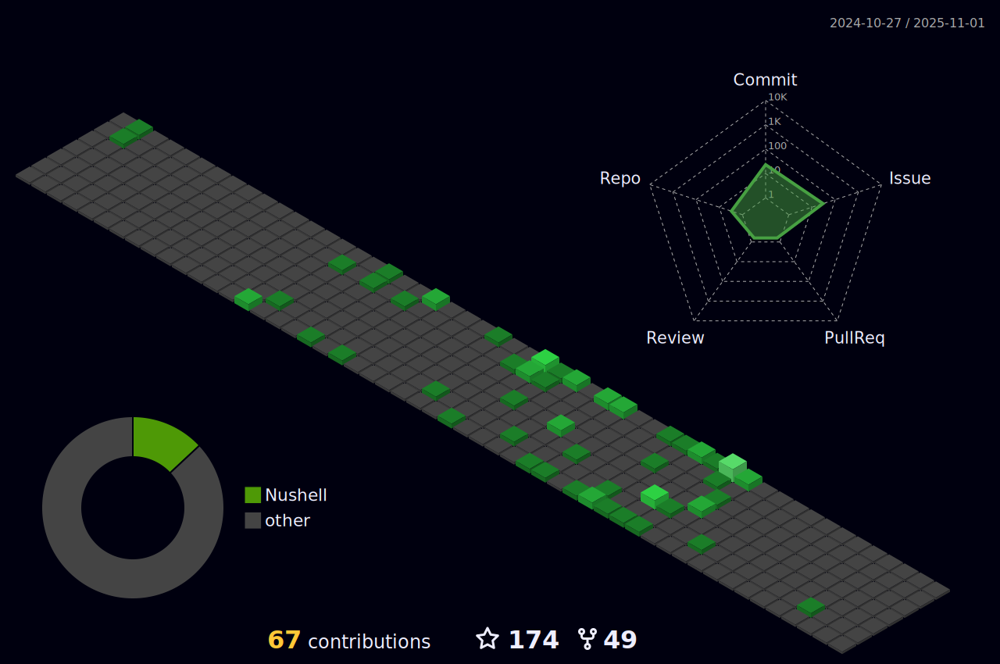

### Greetings!

I'm passionate about Cloud-Native Infrastructure Architecture, which especially & not only implies DevOps, CloudOps & Software Engineer doings.

 

   

My bread & butter is everything related to Kubernetes, including Container based virtualisation technologies in general. My professional software development mostly revolves around engineering cloud applications to be deployed in a Kubernetes environment designed by myself, through a delivery process optimised for the use case at hand.

In the following section, you see a visual representation of some statistics regarding my personal & recreational Github activity.

<section>

 
 

</section>

  
  
  

Kotlin with Spring Boot & PostgreSQL is what I use primarily for Cloud Development.  
 
I am very eager to get more into Rust & WebAssembly for extending into further areas of software development, I am interested in.

If you are in any way interested in working on fun open source projects together with me, do not hesitate to contact me.

